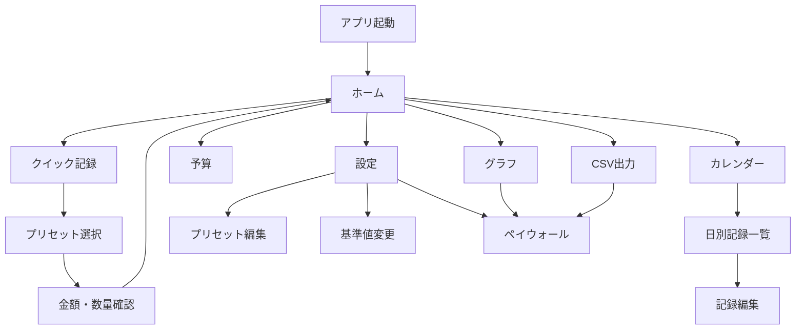

# 飲み代トラッカー 仕様書

この文書が本プロジェクトの単一の真実です。Claude Code は実装前に必ず本書と `CLAUDE.md` を読み、仕様判断に迷った場合は本書を優先してください。

## 1. アプリ概要

- 名称(仮): 飲み代トラッカー
- コンセプト: 「今月、酒にいくら使ったか」を1秒で把握できる家飲み・外飲み支出トラッカー
- 差別化: 既存アプリの健康軸・禁酒軸ではなく、実支出軸で記録する
- 対応規格: 日本の容量規格(350ml缶、500ml缶、中ジョッキ435ml、日本酒1合180ml)を前提にする
- ターゲット: 晩酌習慣があり、飲み代を節約したい20〜50代の日本人
- 動作方式: 完全ローカル動作。サーバー、外部API、アカウント登録は追加しない
- 言語: 日本語のみ

## 2. App Store 審査方針

- 年齢制限は 17+ とする。アルコールへの言及があるため。
- 健康改善、医療効果、節酒効果、禁酒効果、依存症改善を示唆する文言は禁止する。
- 純アルコール量は参考情報としてのみ表示する。
- マスコットのセリフは支出ジョークに限定し、説教、健康注意、飲酒量への評価は禁止する。
- 設定画面に適正飲酒の注意書きを置く。ただし医療助言に見えない文面にする。
- データ収集ゼロの `PrivacyInfo.xcprivacy` を用意する。
- StoreKit 2 実装時は購入復元ボタン、利用規約リンク、プライバシーポリシーリンクを必ず置く。

## 3. 技術要件

- Swift 5.10+
- SwiftUI
- iOS 17.0+
- SwiftData
- WidgetKit + App Group
- StoreKit 2
- Swift Charts
- 外部ライブラリ原則ゼロ
- アーキテクチャは MV + Repository 層。過剰な抽象化はしない。
- 金額は必ず `Int` の円単位で扱う。`Double` / `Decimal` を金額計算に使わない。
- 日付は `Calendar.current` を使い、月境界はユーザーのタイムゾーン基準にする。
- 文字列は `Localizable.strings` に集約する。
- 全画面に `#Preview` を用意する。

### 3.1 整数計算ルール

度数は小数を避けるため `abvTenthsPercent` として保存する。

- 5.0% は `50`
- 7.0% は `70`
- 12.5% は `125`

純アルコール量は表示精度を保つため `pureAlcoholTenthsGram` として 0.1g 単位で保存または計算する。

```text
純アルコール量(g) = 容量(ml) × 度数(%) / 100 × 0.8

pureAlcoholTenthsGram =
  volumeML * abvTenthsPercent * 8 / 1000
```

例: 350ml、5.0% の場合

```text
350 * 50 * 8 / 1000 = 140
=> 14.0g
```

## 4. MVP 機能(v1.0)

### 4.1 クイック記録

ホームから3タップ以内で記録完了できることを最重要要件とする。

標準プリセット:

| プリセット | 場所 | 容量 | 初期度数 | 初期価格 | 備考 |
|---|---|---:|---:|---:|---|
| 缶ビール350 | 家飲み | 350ml | 5.0% | 220円 | 編集可能 |
| 缶ビール500 | 家飲み | 500ml | 5.0% | 300円 | 編集可能 |
| 缶チューハイ350 | 家飲み | 350ml | 7.0% | 170円 | 編集可能 |
| 缶チューハイ500 | 家飲み | 500ml | 7.0% | 230円 | 編集可能 |
| ハイボール | 家飲み | 350ml | 7.0% | 210円 | 編集可能 |
| 日本酒1合 | 家飲み | 180ml | 15.0% | 250円 | 編集可能 |
| ワイングラス | 家飲み | 120ml | 12.0% | 300円 | 編集可能 |
| 外飲み | 外飲み | 0ml | 0.0% | 3000円 | 金額のみ入力 |

3タップフローの推奨:

1. ホームの記録ボタンまたはプリセットをタップ
2. プリセットを選択
3. 確定ボタンをタップ

よく飲むものは `usageCount` と `lastUsedAt` により上位表示する。

### 4.2 今月サマリー

ホーム画面に以下を表示する。

- 今月の飲み代合計。最大表示。
- 先月同日比。
- 家飲み/外飲み内訳。
- 純アルコール量合計(g)。参考情報として小さく表示。
- 休肝日数。記録なしの日を自動カウントする。
- 月次予算の残額と消化ペース。

休肝日は当月1日から今日までを対象にし、未来日は除外する。

### 4.3 マスコット「のみだぬき」

ホーム画面の主役として表示する。

基準値:

- 初期値: 月5,500円
- 根拠: 総務省家計調査ベースの目安。単身世帯の酒類約2,500円 + 外食飲酒代約3,000円。
- 設定画面で変更可能。
- 設定画面に出典注記を表示する。

日割り比較:

```text
ratio = 今月の支出累計 ÷ (基準値 × 経過日数 ÷ 当月日数)
```

0除算回避:

- 基準値が1円未満の場合は内部で1円として扱う。
- 経過日数は最低1日として扱う。
- 当月日数が取得できない場合は30日として扱う。

WealthLevel 判定:

| ratio | 状態名 | enum | 見た目の例 |
|---:|---|---|---|
| < 0.3 | 大富豪 | `grandRich` | 王冠、葉巻、札束、豪邸背景 |
| 0.3〜0.7 | 富豪 | `rich` | シルクハット、ワイングラス |
| 0.7〜1.0 | 小金持ち | `comfortable` | 小綺麗な服、にこにこ |
| 1.0〜1.5 | 庶民 | `normal` | 普段着、普通の表情 |
| 1.5〜2.0 | 金欠 | `broke` | ボロい服、涙目、裸電球 |
| >= 2.0 | 極貧 | `extremePoor` | ツギハギ服、ダンボール、悟りの表情 |

境界値は上の行を含まず、次の行に含める。例: `0.3` は富豪、`0.7` は小金持ち、`1.0` は庶民。

セリフ例:

| WealthLevel | セリフ |
|---|---|
| 大富豪 | 「今夜はドンペリでも開けるかね」 / 「財布が重くて肩がこるのう」 |
| 富豪 | 「今宵は一杯、いただきます」 / 「今日はグラスも輝いて見えるぞ」 |
| 小金持ち | 「なかなか上手にやりくりしておる」 / 「この調子ならおつまみも豪華じゃ」 |
| 庶民 | 「まあ、こんな夜もあるさ」 / 「平常運転じゃな」 |
| 金欠 | 「今月の財布、薄いのう…」 / 「裸電球まで節約モードじゃ」 |
| 極貧 | 「もやし、うまい…」 / 「段ボールも案外あたたかいぞ」 |

禁止:

- 説教
- 健康への言及
- 飲酒量への善悪評価
- 医療、節酒、禁酒効果の示唆

アセット:

- v1.0 は外部イラスト不要。
- SwiftUI 描画 + SF Symbols + 絵文字のプレースホルダーで実装する。
- 後から PNG 差し替え可能な `CharacterView` 抽象化を用意する。
- 状態遷移はアニメーション付きで、少し大げさで面白い演出にする。

### 4.4 カレンダー

- 日別支出のヒートマップを表示する。
- 記録なしの日を休肝日として自動カウントする。
- 今日より未来の日は休肝日に含めない。
- 日をタップすると、その日の記録一覧を表示する。

### 4.5 月次予算

- 月次予算を設定できる。
- 今月残額を表示する。
- 経過日数ベースの消化ペースを表示する。
- 予算未設定の場合は「未設定」と表示し、エラー扱いにしない。

### 4.6 ウィジェット

WidgetKit で小・中を実装する。

- 小: 今月合計 + キャラ
- 中: 今月合計 + 予算残額 + 休肝日数 + キャラ
- 中ウィジェットは有料機能としてペイウォール制御する。
- App Group でアプリ本体とデータ共有する。

### 4.7 有料機能

StoreKit 2 で実装する。

- 買い切り: 600円想定
- サブスク: 200円/月想定
- v1.0 では両方の実装を持ち、リリース時に運用方針を選択する。

有料対象:

- 全期間グラフ(Swift Charts)
- CSV出力
- カスタムプリセット無制限
- 中ウィジェット

無料枠の推奨制限:

- 標準プリセット編集は可能。
- カスタムプリセット追加は3個まで。
- 小ウィジェットは無料。
- グラフは当月のみ簡易表示、全期間グラフは有料。

## 5. 画面一覧

| 画面 | 目的 | 主な要素 | フェーズ |
|---|---|---|---|
| ホーム | 今月支出を1秒で把握 | 今月合計、先月同日比、内訳、のみだぬき、上位プリセット | P3 |
| クイック記録 | 3タップ以内で記録 | プリセット、金額、数量、確定 | P2 |
| 記録編集 | 誤入力修正 | 日時、金額、数量、削除 | P2/P3 |
| カレンダー | 日別支出確認 | ヒートマップ、日別一覧、休肝日表示 | P3 |
| 予算 | 予算管理 | 月次予算、残額、ペース | P4 |
| プリセット編集 | 飲み物設定 | 名称、価格、容量、度数、家/外 | P4 |
| 設定 | 基準値/注意書き/法務 | 5,500円基準、適正飲酒注意、Privacy/Terms | P4/P6 |
| ペイウォール | 有料機能解放 | 買い切り、月額、復元、リンク | P6 |
| グラフ | 全期間推移 | Swift Charts | P6 |
| CSV出力 | データ持ち出し | CSVプレビュー/共有 | P6 |

## 6. 画面遷移図



## 7. SwiftData モデル定義

以下は仕様上の擬似Swift定義です。Claude Code は実装時に SwiftData の制約に合わせて調整してよい。ただし意味と保存項目は維持する。

### 7.1 DrinkPreset

```swift
@Model
final class DrinkPreset {
    @Attribute(.unique) var id: UUID
    var name: String
    var categoryRawValue: String
    var locationRawValue: String
    var defaultPriceYen: Int
    var volumeML: Int
    var abvTenthsPercent: Int
    var iconName: String
    var colorName: String
    var isDefault: Bool
    var isArchived: Bool
    var sortIndex: Int
    var usageCount: Int
    var lastUsedAt: Date?
    var createdAt: Date
    var updatedAt: Date
}
```

`categoryRawValue` 候補:

- `beer`
- `chuhai`
- `highball`
- `sake`
- `wine`
- `outside`
- `custom`

`locationRawValue` 候補:

- `home`
- `outside`

### 7.2 DrinkEntry

```swift
@Model
final class DrinkEntry {
    @Attribute(.unique) var id: UUID
    var occurredAt: Date
    var presetID: UUID?
    var presetNameSnapshot: String
    var categoryRawValue: String
    var locationRawValue: String
    var quantity: Int
    var amountYen: Int
    var volumeML: Int
    var abvTenthsPercent: Int
    var pureAlcoholTenthsGram: Int
    var memo: String
    var createdAt: Date
    var updatedAt: Date
}
```

方針:

- 記録後にプリセットが変更されても過去記録が変わらないよう、名称、価格、容量、度数をスナップショット保存する。
- 外飲みは金額のみ入力のため、初期値では `volumeML = 0`、`abvTenthsPercent = 0`、`pureAlcoholTenthsGram = 0` とする。
- `quantity` は最低1。
- `amountYen` は単価ではなく合計金額。

### 7.3 UserSettings

```swift
@Model
final class UserSettings {
    @Attribute(.unique) var id: UUID
    var baselineMonthlyYen: Int
    var monthlyBudgetYen: Int?
    var hasSeenOnboarding: Bool
    var selectedThemeRawValue: String
    var createdAt: Date
    var updatedAt: Date
}
```

方針:

- `baselineMonthlyYen` 初期値は5500。
- `monthlyBudgetYen` がnilの場合は予算未設定。
- アプリ内に1件だけ存在するシングルトン設定として扱う。

### 7.4 PurchaseEntitlement

```swift
@Model
final class PurchaseEntitlement {
    @Attribute(.unique) var id: UUID
    var productID: String
    var entitlementRawValue: String
    var isActive: Bool
    var expirationDate: Date?
    var latestTransactionID: String?
    var updatedAt: Date
}
```

方針:

- StoreKit 2 の現在状態を反映するキャッシュ。
- 購入状態の最終判断は StoreKit の Transaction 検証結果を優先する。

### 7.5 集計用モデルは作らない

月次集計、休肝日、WealthLevel は Repository / Calculator で都度計算する。保存済み集計との不整合を避けるため、v1.0 では集計キャッシュモデルを作らない。

## 8. Repository / Calculator

P1で最低限用意する。

| 型 | 役割 |
|---|---|
| `DrinkEntryRepository` | 記録の作成、取得、更新、削除 |
| `DrinkPresetRepository` | 標準プリセットの初期投入、並び順、使用回数更新 |
| `SettingsRepository` | `UserSettings` の取得、初期化、更新 |
| `SummaryRepository` | 月次サマリーの組み立て |
| `AlcoholCalculator` | 純アルコール量の整数計算 |
| `MonthCalculator` | 月初、月末、経過日数、先月同日範囲 |
| `CharacterEngine` | ratio と WealthLevel、セリフ選択 |
| `CSVExporter` | P6で実装。CSVエスケープのテスト必須 |

Repository は SwiftData の `ModelContext` を受け取り、UI から直接 SwiftData クエリが増えすぎないようにする。ただし過剰な DI コンテナは作らない。

## 9. ディレクトリ構成

```text
NomidaiTracker/
|-- NomidaiTracker.xcodeproj/
|-- NomidaiTracker/
|   |-- App/
|   |   |-- NomidaiTrackerApp.swift
|   |   `-- AppEnvironment.swift
|   |-- Models/
|   |   |-- DrinkEntry.swift
|   |   |-- DrinkPreset.swift
|   |   |-- UserSettings.swift
|   |   `-- PurchaseEntitlement.swift
|   |-- Repositories/
|   |   |-- DrinkEntryRepository.swift
|   |   |-- DrinkPresetRepository.swift
|   |   |-- SettingsRepository.swift
|   |   `-- SummaryRepository.swift
|   |-- Calculators/
|   |   |-- AlcoholCalculator.swift
|   |   |-- MonthCalculator.swift
|   |   `-- CharacterEngine.swift
|   |-- Views/
|   |   |-- Home/
|   |   |-- QuickRecord/
|   |   |-- Calendar/
|   |   |-- Settings/
|   |   |-- Paywall/
|   |   `-- Components/
|   |-- Resources/
|   |   |-- Localizable.strings
|   |   `-- PrivacyInfo.xcprivacy
|   `-- Supporting/
|       |-- AppGroup.swift
|       `-- ProductIDs.swift
|-- NomidaiTrackerWidget/
|-- NomidaiTrackerTests/
|-- SPEC.md
|-- CLAUDE.md
`-- AGENTS.md
```

## 10. フェーズ計画

各フェーズでビルド確認とコミットを必須とする。コミットメッセージは日本語1行。

### P1: プロジェクト構成 + SwiftDataモデル + Repository + ユニットテスト

目的:

- iOS 17 SwiftUI プロジェクトを作る。
- SwiftData モデルを作る。
- Repository と Calculator の土台を作る。
- P1範囲の XCTest を追加する。

完了条件:

- アプリがビルドできる。
- SwiftData コンテナが起動時に初期化される。
- 標準プリセットが初回起動時に投入される。
- 金額が Int で扱われている。
- 度数が `abvTenthsPercent` の整数で扱われている。
- 純アルコール量が整数計算で算出される。
- `MonthCalculator` が `Calendar.current` ベースで月初/月末/経過日数を扱える。
- `CharacterEngine` が ratio から WealthLevel を判定できる。
- 関連ユニットテストが通る。
- ビルド/テスト確認後に日本語1行でコミットされている。

### P2: クイック記録画面(3タップフロー)

目的:

- 3タップ以内で記録完了する導線を作る。
- 使用頻度順のプリセット表示を実装する。

完了条件:

- ホームまたは仮ホームから記録画面へ遷移できる。
- 標準プリセットで記録を追加できる。
- 外飲みは金額のみで記録できる。
- 記録後に `usageCount` と `lastUsedAt` が更新される。
- 入力バリデーションがある。

### P3: ホーム画面 + サマリー + CharacterEngine + CharacterView + カレンダー

目的:

- 今月サマリーと「のみだぬき」をホームの主役として実装する。
- カレンダーのヒートマップを実装する。

完了条件:

- 今月合計、先月同日比、家/外内訳、純アルコール量、休肝日が表示される。
- WealthLevel に応じてキャラ表示とセリフが変わる。
- 状態遷移にアニメーションがある。
- 日別ヒートマップが表示される。

### P4: 月次予算 + 設定画面

目的:

- 予算設定、基準値変更、プリセット編集、注意書きを実装する。

完了条件:

- 月次予算を設定/解除できる。
- 基準値5,500円を変更できる。
- プリセットの価格、容量、度数を編集できる。
- 適正飲酒の注意書きと出典注記がある。
- 健康・医療効果を謳う文言がない。

### P5: WidgetKit

目的:

- 小・中ウィジェットを実装する。
- App Group でデータ共有する。

完了条件:

- 小ウィジェットに今月合計とキャラが出る。
- 中ウィジェットに今月合計、予算残額、休肝日数、キャラが出る。
- 中ウィジェットは有料機能フラグに従う。
- App Group の共有漏れがない。

### P6: StoreKit 2 + 有料機能

目的:

- ペイウォール、購入、復元、有料機能制御を実装する。
- 全期間グラフと CSV 出力を実装する。

完了条件:

- StoreKit 2 で買い切りとサブスク両方の状態を扱える。
- 購入復元ボタンがある。
- 利用規約、プライバシーポリシーリンクがある。
- Swift Charts で全期間グラフが表示される。
- CSV 出力ができ、CSV エスケープのテストがある。

## 11. v1.1 ロードマップ

### CloudKit同期

- SwiftData + CloudKit で複数端末同期する。
- `UUID` 主キーを維持する。
- 集計キャッシュを保存しない方針を維持する。
- CloudKit 導入前に SwiftData マイグレーション計画を作る。

### Live Activity

- 今月支出、予算残額、のみだぬき状態をロック画面 / Dynamic Island に表示する。
- 飲酒中タイマーではなく支出トラッカーとして表現する。
- 健康/節酒効果に見える文言は禁止する。

### 追加候補

- レシート手入力補助
- 月別レポート画像生成
- PNG版のみだぬきアセット差し替え
- iCloudバックアップ/エクスポート強化

## 12. 未確定事項と推奨仮決め

| 質問 | 推奨仮決め |
|---|---|
| Bundle ID | `com.momi0216yama.nomidaitracker` |
| App Group ID | `group.com.momi0216yama.nomidaitracker` |
| Product ID | `nomidai.pro.lifetime` と `nomidai.pro.monthly` |
| アプリ正式名 | v1.0 は「飲み代トラッカー」。キャラ名は画面内で「のみだぬき」。 |
| 外飲みの純アルコール量 | 金額のみ要件を優先し、v1.0 では0g扱い。表示に「容量入力なし」と注記する。 |
| 利用規約/プライバシーポリシーURL | P6までに GitHub Pages 等で用意する。P1ではプレースホルダー定数のみ。 |
| 標準プリセット価格 | 本書の初期価格で仮実装。P4で編集可能にする。 |
| 有料方式 | 実装は買い切り・サブスク両対応。リリース直前に片方を App Store Connect で有効化する。 |
